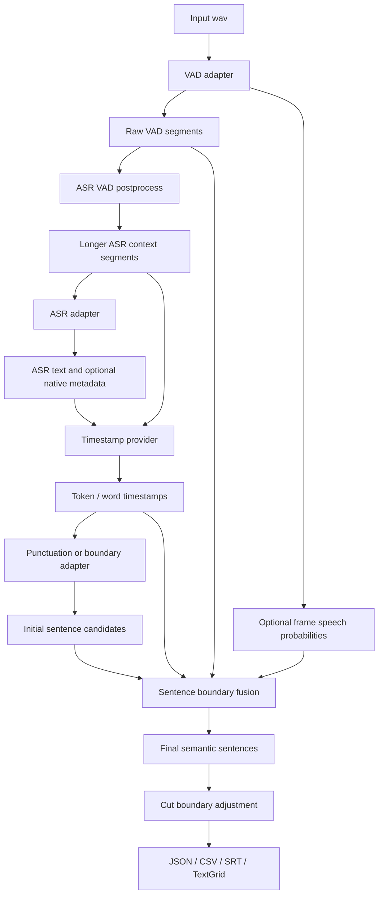

# Current Pipeline Architecture

This document describes the current standalone Semantic ASR architecture. It is
the maintenance companion to `docs/codex_context.md`.

## Goal

The project converts long audio into reviewable semantic speech segments with
stable timestamps and standard exports.

The practical priority order is:

```text
avoid cutting speech > keep segment duration usable > preserve semantic meaning
```

## Mandatory Roles

Every profile under `configs/` declares all four roles:

| Role | Contract |
| --- | --- |
| `vad` | Detect raw speech islands and optionally frame-level speech probability. |
| `asr` | Transcribe VAD-derived audio contexts. |
| `timestamp` | Validate native timestamps or force-align ASR text to audio. |
| `punc` | Restore punctuation or provide sentence-boundary decisions. |

No role is optional. If an ASR model already has punctuation or timestamps, the
profile still declares `asr_native`, `asr_text`, or a native timestamp provider.

## Runtime Flow



## Key Data Surfaces

The JSON output is the source of truth for debugging:

- `raw_vad_segments_ms`: original VAD speech islands.
- `asr_vad_segments_ms`: merged speech contexts used for ASR/timestamping.
- `vad_segments_ms`: output-oriented VAD segments.
- `vad_frame_speech_probs`: optional VAD probability stream.
- `words`: token/word timestamps.
- `sentences`: final semantic sentences.
- `sentence_boundary_decisions`: why each candidate boundary was kept or merged.
- `cut_segments_ms`, `cut_start_ms`, `cut_end_ms`: final export boundaries.

Writers should use `cut_start_ms` and `cut_end_ms` when available.

## Language Configuration

Users configure canonical language-region ids such as:

- `zh_cn`
- `yue_hk`
- `ar_sa`
- `de_de`
- `ko_kr`
- `ja_jp`
- `vi_vn`

Adapters convert these ids to model-native formats internally. Users should not
need to know whether a model wants `zh`, `cmn`, `Chinese`, or another code.

## Model Capability Rules

Each model has metadata in `semantic_asr/language_support.py`:

- role
- supported languages
- aliases
- native timestamp support
- native punctuation support
- batch support
- notes

The CLI model-query commands and docs should be treated as views over this
metadata, not independent truth.

## Outputs

The pipeline writes:

- `<uttid>.json`
- `result.jsonl`
- `asr_csv/<uttid>.csv`
- `asr_srt/<uttid>.srt`
- `asr_tg/<uttid>.TextGrid`
- `resolved_config.json`

TextGrid overlap is a strategy error. Do not hide it in the writer.
