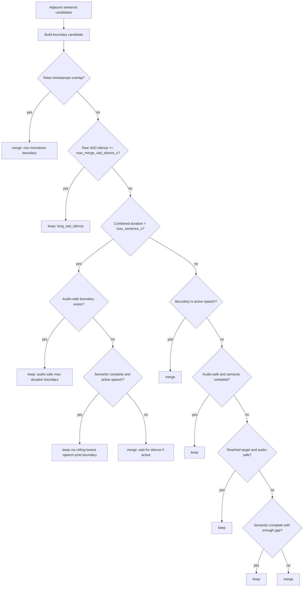

# Sentence Boundary Strategy

This document explains the current sentence split/merge strategy in practical
debugging terms.

## Priority

The current product goal is:

```text
avoid cutting speech > keep output length usable > preserve semantic meaning
```

This order matters. Earlier iterations over-weighted semantic punctuation and
produced long unusable segments, or over-weighted duration and cut through
speech. The current strategy tries to choose audio-safe boundaries while still
respecting configurable duration caps.

## Inputs

Boundary fusion receives:

- initial sentence candidates from punctuation or boundary strategy
- token/word timestamps
- raw VAD segments
- optional VAD frame speech probabilities
- `SentenceBoundaryFusionConfig`

Important config fields:

| Field | Meaning |
| --- | --- |
| `enabled` | Whether boundary fusion runs. |
| `min_vad_silence_s` | Minimum raw VAD silence that can support a boundary. |
| `max_merge_vad_silence_s` | Silence longer than this becomes a hard boundary. |
| `merge_max_token_gap_s` | Small token gaps inside same VAD island tend to merge. |
| `target_sentence_s` | Desired output duration pressure. |
| `max_sentence_s` | Usability cap; not a blind cut point. |
| `rolling_boundary_max_candidates` | Recent candidates considered after max duration pressure. |
| `speech_prob_*` | Frame-probability silence/active thresholds. |
| `preserve_sentence_gaps` | Preserve actual inter-sentence silence instead of making boundaries touch. |

## Candidate Analysis

For every adjacent sentence pair, the pipeline computes a boundary candidate:

1. Find previous sentence's last timestamped token.
2. Find current sentence's first timestamped token.
3. Compute token gap.
4. Check whether both sides are in the same raw VAD island.
5. Check whether raw VAD supports silence between them.
6. Search frame speech probabilities near the candidate boundary.
7. Snap to the local lowest speech-probability point when supported.
8. Classify semantic completeness using punctuation, continuation punctuation,
   short fragments and duration pressure.

The decision record is written into `sentence_boundary_decisions`.

## Decision Rules

The simplified rule order is:



## Rolling Boundary Selector

When the group exceeds `max_sentence_s`, the pipeline should not simply keep the
first boundary after the cap. Instead it looks back over recent semantic-complete
candidates and chooses the one with the lowest local speech probability.

This is important for cases where the first over-cap candidate falls inside
speech but a slightly earlier or later candidate has a better acoustic valley.

## Raw VAD And ASR VAD Are Different

Raw VAD is used for final cut safety and debugging.

ASR VAD may be merged into longer contexts so ASR and forced alignment have more
context. Do not assume ASR context segments are final output segments.

## MMS Notes

MMS alignment has two important constraints:

- Numeric/currency/symbol tokens can be unalignable. These are replaced with
  placeholder stars during alignment and restored afterward.
- For Chinese, Japanese and Korean the timestamp stream is effectively
  character-level. Do not consume timestamps by whitespace token count.

`<star>` has two different uses:

- placeholder star for unalignable text tokens
- gap-probe star used to infer real silence between tokens

These must remain distinguishable in code and debug output.

## Final Cut Fields

`start_ms` and `end_ms` describe semantic/timestamp sentence boundaries.

`cut_start_ms` and `cut_end_ms` are final export boundaries after VAD-safe
adjustment and optional padding. CSV/SRT/TextGrid should use cut fields.

## Debug Checklist

When a boundary looks wrong:

1. Locate the sentence in JSON.
2. Inspect `cut_start_ms`, `cut_end_ms`, `start_ms`, `end_ms`.
3. Compare with `raw_vad_segments_ms`.
4. Inspect neighboring token timestamps.
5. Inspect `sentence_boundary_decisions` around the candidate.
6. Check whether the reason was active speech, long VAD silence, max duration,
   semantic punctuation, rolling selection, or non-monotonic merge.
7. Only then change strategy code.
