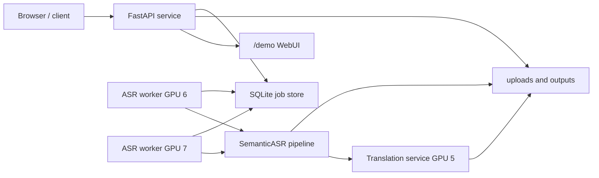
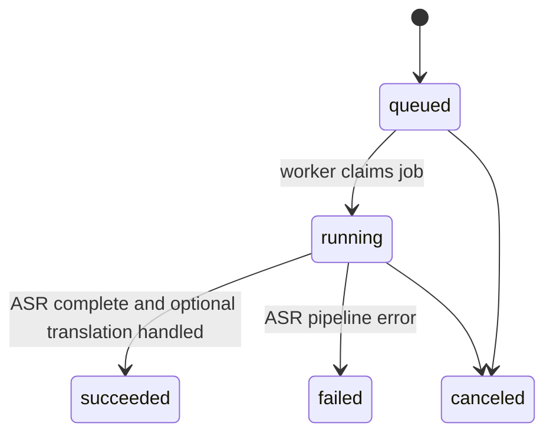

# Service Runtime

The service layer makes Semantic ASR usable by ordinary remote users without
shell access to the GPU machine.

## Components

## API

Main endpoints:

- `POST /v1/jobs`
- `GET /v1/jobs/{job_id}`
- `GET /v1/jobs/{job_id}/result`
- `GET /v1/jobs/{job_id}/artifacts/{format}`
- `GET /v1/models`
- `GET /health`
- `GET /demo`

The API process should only accept requests, serve metadata and return
artifacts. Heavy ASR work belongs in worker processes.

## Current Local Convention

| Component | Default |
| --- | --- |
| WebUI/API bind | `0.0.0.0:10086` |
| Demo token | `demo-local` |
| ASR worker GPUs | `6,7` |
| Translation GPU | `5` |
| Translation ports | `10096,10097,10098` |
| Service data root | `service_data/demo` |

These are local operational defaults, not hard-coded product requirements.

## Job Lifecycle

Optional translation should not turn a valid ASR result into a failed ASR job.
If translation fails, record translation error/progress and keep ASR artifacts
available.

## Worker Rules

- Claim a job before loading large models.
- Log startup device, pid, worker id and model loading stage.
- Keep ASR workers and translation workers as separate resource pools.
- Use conservative GPU concurrency first; increase only after checking memory
  and throughput.
- `--num-workers` means workers per selected GPU for batch CLI.

## WebUI Behavior

The demo page should support:

- default token `demo-local`
- username-based task filtering
- language/profile selection frozen at upload start
- multi-file upload progress
- status polling
- artifact download
- waveform review
- segment click-to-play without spilling into the next segment
- original/translation/bilingual display
- language and username filters

## Storage

Uploads and outputs live under the configured service data directory. They are
runtime artifacts and should not be committed.

The repository should only contain source, configs, docs, examples and tests.
